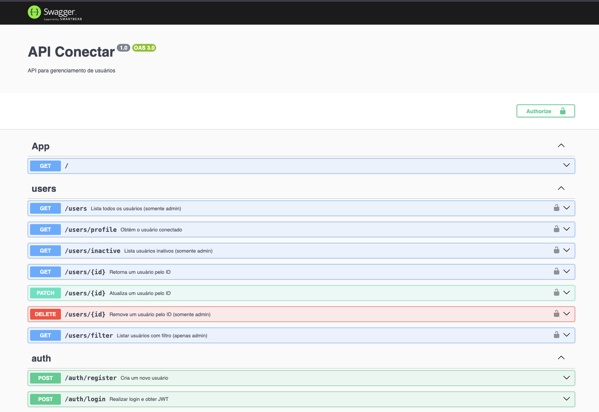

# 🛠️ Conéctar — API Backend (NestJS)

Backend da **Conéctar**, plataforma de gestão de usuários com autenticação JWT.  
Construído em **NestJS + TypeORM** e pronto para produção.

**Deploy:** [https://seusite.com](https://seusite.com)


## 📄 Licença


> ⚠️ Recomendamos usar Node.js v18 ou superior para compatibilidade com as dependências.

---
## 🚀 Tecnologias Utilizadas

<p align="center">
  
  
  
  
  
</p>

---

## ✨ Recursos

| Módulo | Descrição |
| :---- | :---- |
| **Auth** | Registro & login via **JWT**, refresh‑token opcional |
| **Users** | CRUD de usuários com filtros (role, nome, datas) |
| **Admin** | Endpoints restritos por **role** (RBAC) |
| **Inativos** | `/users/inactive?days=30` lista contas sem login há *n* dias |
| **Swagger** | Documentação interativa em **/api** com botão *Authorize* |

---

## 🚀 Stack

- **NestJS 10** • **TypeScript 5**
- **TypeORM** + **MySQL** (pode trocar facilmente para PostgreSQL/MariaDB)
- **JWT** (access + refresh)
- **Swagger** para docs
- **Jest** + **SuperTest** para testes
- **Yarn** scripts & hooks **Husky + Lint‑staged**

---

## 📦 Instalação

```bash
git clone https://github.com/BlockChain-Oberion/conectar.git
cd conectar
yarn
cp .env.example .env
```

Configure o `.env`:

```env
# App
PORT=3000
JWT_SECRET=super_secret

# MySQL
DB_HOST=localhost
DB_PORT=3306
DB_USERNAME=root
DB_PASSWORD=
DB_DATABASE=conectar_db


```

---

## ▶️ Execução

| Comando              | Ação                                                              |
|----------------------|-------------------------------------------------------------------|
| `yarn start:dev`     | Inicia em modo desenvolvimento com **TS‑Node** e **Hot‑Reload**   |
| `yarn start:prod`    | Compila e executa o projeto em produção a partir da pasta `dist/` |
| `yarn migration:run` | Aplica as **migrações** definidas no TypeORM                      |
| `yarn test`          | Executa os testes unitários com **Jest**                          |
| `yarn test:cov`      | Gera o **relatório de cobertura de testes**                       |


Acesse: [http://localhost:3000/api](http://localhost:3000/api) para a documentação Swagger.

---

## ✅ Funcionalidades

O backend Conéctar oferece uma API robusta com autenticação via JWT e gestão completa de usuários. As principais funcionalidades são:

- 🔐 **Autenticação segura com JWT**
- 👤 **Cadastro e login de usuários**
- 🧾 **Listagem de usuários** (com filtros por nome, role, data e status)
- 🛂 **Visualização e edição do próprio perfil**
- 📌 **Atualização e deleção de usuários (admin)**
- 🚫 **Listagem de usuários inativos** (filtro por dias)
- 🔎 **Busca por ID com validação de permissão**
- 🧩 **Swagger completo com testes via token Bearer**
- ✅ **Guards de autenticação e autorização**
- 🧪 **Testes unitários com Jest**

---

## 🔐 Rotas / Endpoints

> Todas as rotas (exceto `register` e `login`) exigem **Bearer Token** no header de autorização.

---

### 📘 Auth

| Método | Rota             | Descrição                 |
|--------|------------------|---------------------------|
| POST   | `/auth/register` | Cria conta                |
| POST   | `/auth/login`    | Retorna `access_token`    |

---

### 👥 Users

| Método | Rota                                              | Quem pode                 | Descrição                  |
|--------|---------------------------------------------------|---------------------------|----------------------------|
| GET    | `/users`                                          | `admin`                   | Lista todos os usuários    |
| GET    | `/users/profile`                                  | `logado`                  | Retorna perfil do usuário  |
| GET    | `/users/status`                                   | `logado`                  | Status da conta            |
| PATCH  | `/users/profile`                                  | `logado`                  | Atualiza perfil logado     |
| GET    | `/users/inactive?days=30`                         | `admin`                   | Lista inativos por tempo   |
| GET    | `/users/filter?role=admin&sortBy=name&order=asc`  | `admin`                   | Filtro por role, nome, data|
| GET    | `/users/:id`                                      | `admin` ou `proprietário` | Detalha usuário por ID     |
| PATCH  | `/users/:id`                                      | `admin` ou `proprietário` | Atualiza usuário por ID    |
| DELETE | `/users/:id`                                      | `admin`                   | Remove usuário             |

---

📌 **Observação:**  
Algumas rotas como `/users/:id` exigem verificação de **role** ou se o usuário é o **proprietário** da conta.


---

## 🧪 Testes

```bash
yarn test
```

---

## 📂 Estrutura

```
src
 ├── auth/
 │   ├── dto/
 │   ├── guards/
 │   ├── strategies/
 │   ├── auth.controller.ts
 │   └── auth.service.ts
 ├── users/
 │   ├── dto/
 │   ├── entities/
 │   ├── users.controller.ts
 │   └── users.service.ts
 ├── database/
 ├── app.controller.ts
 ├── app.module.ts
 └── main.ts

```

---

## 📃 Documentação Swagger


Disponível em:  
🔗 [`http://localhost:3000/api`](http://localhost:3000/api)

Inclui:
- Descrição de todos os endpoints
- Teste de login direto pelo Swagger
- Proteção com Bearer Token

---

## ✍️ Autor

Desenvolvido por **Leonardo Toledo**  
📧 leotoledo010@gmail.com  
🔗 [github.com/leonardotoledo0](https://github.com/LeonardoToledo0)

---

## 📝 Observações

- JWT protegido com `@UseGuards(JwtAuthGuard)`
- Apenas admins têm acesso a rotas críticas (como `GET /users`)

---

## 📄 Licença

Este projeto está licenciado sob a **Licença MIT**.

Veja o arquivo [LICENSE](./LICENSE) para detalhes completos.

---

Você pode usar, modificar e distribuir o código conforme os termos da licença MIT.
